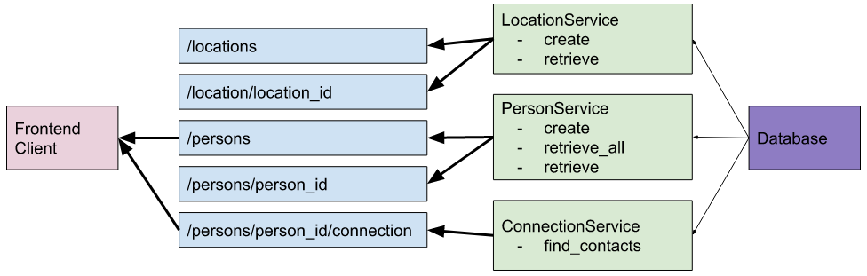

<!-- Improved compatibility of back to top link: See: https://github.com/othneildrew/Best-README-Template/pull/73 -->

<!--
*** Thanks for checking out the Best-README-Template. If you have a suggestion
*** that would make this better, please fork the repo and create a pull request
*** or simply open an issue with the tag "enhancement".
*** Don't forget to give the project a star!
*** Thanks again! Now go create something AMAZING! :D
-->

# Project 4: Data Lake

 26/12/22 

### Udacity Bosch AI Talent Accelerator Scholarship
### Ferdinand Kleinschroth
(ferdinand.kleinschroth@gmx.de)

 

<!-- ABOUT THE PROJECT -->
## About The Project

## 1. Review and Plan

The dependency graph of the starter project is shown in the image above.

The following message passing stragegies will be implemented ien a microservice architecture:
- The RÉST API's for the persons, locations and connection between person and location (shown in blue) will remain REST API's, since they are exposed to the users. Offering REST API's will provide a more convenient user experience since our users will be familiar with this kind of API.
- New REST API's to delete or change person and location entris will be implemented.
- Services (shown in green) will be implemented as microservices that will communicate with the user-exposed API's via grpc. The reason for using gRPC for the communication between the microservies is that this type of message passing is more efficient. These services will not be exposed directly to the end users. So the unfamiliarity of the end users with gRPC is not a concern.
- To make to solution more robust and user-friendly during a high time of high 

## Discussion of future improvements

## Acknowledgments

- The template for the README was taken from [Best-README-Template (GitHub repo)](https://github.com/othneildrew/Best-README-Template).

